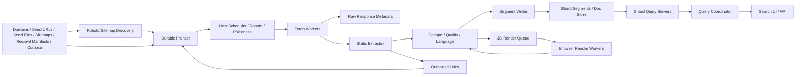
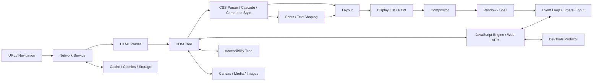
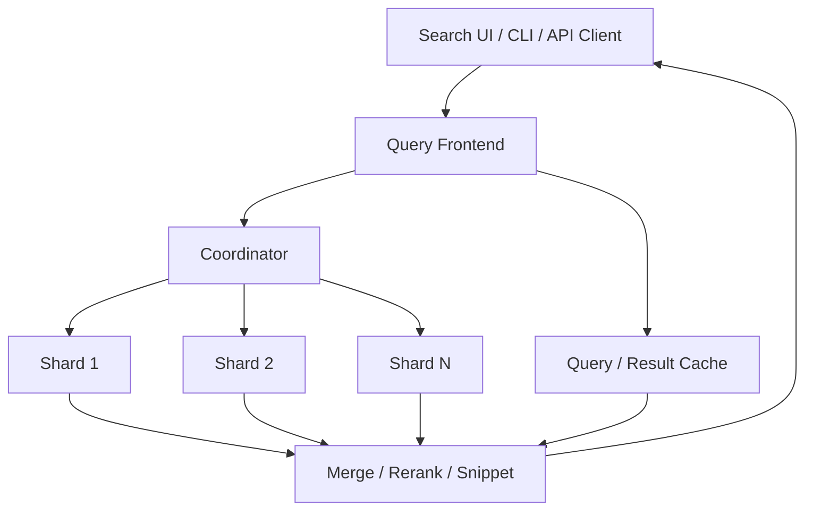

# Brutal Browser Architecture

This document shows the target architecture for the browser-first project.
Brutal Browser is the primary engine and product direction. Blackium Starium✴ is the
fast text/index/extraction mode that shares loading, parsing, extraction,
benchmarking, and automation infrastructure with the browser engine.

The current repository implements static extraction, local index, CLI, daemon,
benchmark pieces, a first link-authority ranking feature over indexed outbound
links, first-pass query operators including language/freshness filters, and a
first `brutal-browser` runtime skeleton with static DOM/CSS text and text-color
rendering, tiny inline/external script DOM
creation/text/tree traversal/insertion/fragment/selector/inner-html/attribute
mutations, and first inline/listener click dispatch plus early CLI link
listing/activation and coordinate-click routing through local display-list hit
testing, including explicit one-shot `click-at` viewport offsets. This is a
scaffold, not a full browser architecture yet.

## Search Pipeline

Required properties:

- Frontier is persistent and restartable.
- Fetchers are polite by host and bounded by global budgets.
- Static extraction is always the first lane.
- JS render workers are opt-in for low-confidence pages.
- Index segments are immutable and verifiable.
- Query serving can fan out across shards and degrade predictably.

## Browser Runtime Pipeline

Required properties:

- Browser runtime does not use Chromium/WebKit/Gecko as the page engine.
- The browser architecture prioritizes JS runtime/Web APIs,
  loading/navigation, compositor-backed RGBA raster, sandbox/site isolation,
  profile/storage isolation, fonts/text, canvas/media, and maintainable
  file-size/module boundaries.
- Current seed implementation covers static URL/file load, HTML parsing, DOM
  construction, simple CSS `display` and `color`, tiny inline/external
  JavaScript title/text mutations, node creation/append/tree mutation/traversal/insertion/fragment,
  `Element.matches`/`Element.closest`, `innerHTML` mutation/readback, form-control DOM properties, location readback properties, `setAttribute`/`getAttribute`, classList mutation/readback over supported
  class selectors, DOM query collection bindings, style property mutation/readback over the supported inline
  CSS subset, inline
  `onclick` and `addEventListener("click", ...)` dispatch, origin-scoped
  localStorage, BrowserSession-scoped sessionStorage, document/window lifecycle
  listener dispatch, deterministic timer task
  draining, block text layout, a small CSS background/border/padding/margin/sizing box-model subset, and terminal
  text rendering with deterministic text/styled-text/rectangle/image
  display-list commands, display-list hit-test reports, and local
  layer-tree/debug snapshots for the supported display-list subset.
- Security boundaries are designed before broad web exposure.
- [`SECURITY_PRIVACY_PLAN.md`](SECURITY_PRIVACY_PLAN.md) is the baseline threat
  model; browser/search releases must add direct gates for sandboxing, origin
  policy, privacy, abuse, fuzzing, and updates before the readiness audit can
  pass.
- Standards tests and screenshot tests gate subsystem progress.
- [`BROWSER_RENDERING_COMPOSITOR_PLAN.md`](BROWSER_RENDERING_COMPOSITOR_PLAN.md)
  is the gate plan for display-list correctness, paint order, rasterization,
  layer trees, compositing frame timing, hit testing, visual regression,
  GPU/resource safety, and screenshot artifacts.
- Fonts, media, canvas, accessibility, devtools, storage, and input are explicit
  subsystems rather than "later polish."
- [`PLATFORM_COMPLETENESS_PLAN.md`](PLATFORM_COMPLETENESS_PLAN.md) is the
  platform subsystem gate list for fonts/text, images/SVG, canvas/GPU, media,
  accessibility, input/editing, storage, devtools, extensions, packaging,
  updates, and search integration.
- Search extraction can use browser render workers without making every crawl
  page pay the full browser cost.

## Browser Module Boundary Map

The current `StaticBrowserEngine` is the seed implementation. Future browser
work should split it into focused modules before growing broad feature sets.

| Module | Owns | First gates |
| --- | --- | --- |
| Loading/resources | URL/file/HTTP(S) loads, redirects, MIME policy, subresource discovery, fetch/cache reports, preload priority | Loader fixtures, network/WPT subsets, timeout and cache tests |
| Forms | Form extraction, control state, GET/POST construction, submit/reset default actions, validation/focus policy | Form fixtures, session-submit tests, Web API/WPT form subsets |
| Images | Image discovery, decode cache, PNG/JPEG/SVG/data URL handling, sizing, lazy/responsive image policy | Decode fixtures, visual baselines, memory/resource gates |
| CSS/style | CSS parser, selector matching, cascade, inheritance, computed style, invalidation, stylesheet fetch/application | CSS fixtures, selector benchmarks, CSS WPT subsets |
| Layout | Block/inline/replaced elements, text metrics, flex/grid/table/forms, scrolling, viewport constraints | Layout fixtures, reftests, stress and memory gates |
| Display-list/paint | Paint order, stacking, clipping, backgrounds/borders/text/images, hit-test inputs | Display-list snapshots, paint-order tests, visual diffs |
| Raster/compositor | RGBA raster, tile/layer tree, frame scheduler, GPU path with CPU fallback, input/scroll latency | Pixel baselines, frame-time gates, GPU/context-loss tests |
| Runtime/Web APIs | JS engine binding, event loop, timers, DOM bindings, Web IDL, fetch/storage/workers/modules | JS benchmarks, Web API WPT subsets, resource-limit tests |
| Input/events | Event targets/listeners/payloads, focus/input/keyboard/edit dispatch, cancellation, propagation, and default-action ordering | Event-order fixtures, session-event tests, hit-test-to-event traces, DOM Events WPT slices |
| Session/navigation | `BrowserSession`, history, link activation, navigation lifecycle, BFCache/session restore, page state | Session smoke tests, navigation fixtures, crash-recovery gates |
| Storage/profile | Cookies, localStorage, IndexedDB, Cache API, permissions, profile dirs, private mode, partitioning | Storage WPT subsets, quota/eviction, profile-isolation tests |
| Shell/CLI | `brutal-browser browse`, command parsing, local render output, scripted runs, product-shell handoff | CLI smoke tests, workflow fixtures, UX/product gates |
| Benchmarks/gates | Browser coverage, perf reports, WPT/compat dashboards, readiness/audit integration | `brutal-browser coverage`, `brutal-bench browser-perf`, readiness audit |

Rules for future agents:

- Keep one owner per write set. If a change crosses modules, name the boundary
  and add focused evidence on both sides.
- Extract a module before feature growth when a browser file becomes large,
  mixes unrelated ownership, or prevents isolated tests.
- Every subsystem needs focused fixtures, WPT/compat coverage where applicable,
  performance gates, and security/fuzz gates before supporting a browser claim.

## Serving Topology

Required properties:

- Query deadlines are explicit.
- Partial shard failures are visible in responses and metrics.
- Cache hits do not hide correctness regressions in benchmark runs.
- Snippet generation is measured as part of query-plus-render latency.
- Query operators that affect candidate selection are parsed before scoring so
  daemon, CLI, and HTTP API search share the same behavior. Current phrase
  operators are query-layer token-adjacency filters; the target architecture
  moves phrase/proximity execution into positional index data.
- Required `+term` operators and uppercase `OR` groups are candidate filters
  layered over postings; richer boolean expressions still belong in a dedicated
  query planner.
- Prefix suggestions are served from the resident lexicon so CLI, daemon, HTTP
  API, and UI autocomplete share the same hot index source.
- First-pass spelling corrections use bounded edit distance over the same
  resident lexicon; production spelling should move to dedicated dictionaries
  and query-level rewrite evaluation.
- Document metadata in the hot index now includes language and fetched time for
  first-pass candidate filters; future ranking should turn those into scored
  freshness and locale features.

## Data Stores

| Store | Purpose | Minimum durability |
| --- | --- | --- |
| Frontier | URL crawl state, host state, recrawl timestamps | Required |
| Raw metadata | HTTP status, redirects, headers, hashes, fetch telemetry | Required |
| Text/doc store | Extracted text, metadata, snippets, title, language, fetched time, fields | Required |
| Inverted index | Lexicon, postings, positions, skip/block-max data | Required |
| Link graph | Edges, anchor text, authority features; current index stores first-pass normalized authority | Required for relevance |
| Evaluation data | Queries, judgments, benchmark reports | Required for gates |
| Readiness audit | Search/browser/security/platform/operations completion matrix and requirement traceability | Required before public claims |
| Evidence registry | Commands, fixtures, external suites, reports, release bundle layout, and completion standards | Required before moving requirements to implemented |
| Operations state | Health, metrics, logs, traces, snapshots, release manifests, incidents | Required before production operation |
| Platform evidence | WPT subsets, screenshots, accessibility audits, media/canvas/devtools reports, signed packages | Required before browser platform claims |
| Rendering evidence | Display lists, screenshots, layer trees, paint/raster/compositor benchmarks, pixel diffs | Required before browser rendering claims |
| Browser profile | Cookies, cache, storage, permissions, history | Browser product |

## Critical Interfaces

- `FrontierStore`: add/discover URLs, claim fetch work, record fetch result,
  schedule recrawl, inspect host state.
- `RecrawlScheduler`: select due fetched URLs from frontier state, recrawl
  batches, rebuild the hot index from latest crawl snapshots, and emit freshness
  reports.
- `Extractor`: raw response to fielded document plus links and quality signals.
- `DuplicateClusterer`: canonical URL, extracted-text fingerprints, and
  shingled simhash signatures to representative/count metadata used for result
  collapsing.
- `QualityPolicy`: meta robots noindex, thin-content thresholds, and later spam,
  malware, safety, and canonical-quality classifiers used before ranking.
- `SegmentWriter`: fielded documents to immutable index segment.
- `ShardReader`: query terms and filters to top-k candidates with scores.
- `QueryCoordinator`: query request to merged ranked response.
- `RenderWorker`: URL or raw response to rendered text/DOM snapshot with timeout.
- `StaticBrowserEngine`: local/HTTP(S) load, HTML parser, DOM tree, simple style
  matching, block text layout, anchor-link extraction/resolution, static form
  extraction, static subresource discovery, subresource fetch/cache reports, GET
  form URL construction, bounded HTTP(S) redirect following with redirect-set
  cookie propagation, external stylesheet application for text layout,
  query-safe local loading, text/styled-text display-list commands, and
  terminal/JSON render output plus fixture-manifest verification.
- `BrowserShell`: the early `brutal-browser browse` local CLI shell over
  the supported `BrowserSession` subset: open/back/forward, current-page
  relative open/go target resolution, current-page location reporting, current
  in-memory cookie inspection/clearing, optional JSON `--cookie-jar` load/save,
  optional JSON `--local-storage` load/save, localStorage inspection/clearing,
  in-memory sessionStorage inspection/clearing, current-page link listing, resolved-link
  activation through `link` / `follow` / `activate` by zero-based index, exact
  text, or anchor selector, selector click with narrow
  anchor href default navigation through session history, coordinate-click
  routing through display-list hit testing into supported event/default-action
  navigation, one-shot `click-at` viewport-offset routing, rendered
  fragment-target scrolling for the CLI text viewport, narrow document-level
  wheel dispatch before local shell viewport movement,
  remembered text-like form field values on the current
  `BrowserSession` entry for later GET submit, single-select choice state,
  checkbox/radio checked state and explicit checkable-control toggles, selector/associated-label focus and
  typed-text append for fillable controls, current-entry reload/refresh, fixed
  text-viewport scroll, current-page render, optional scripted `--cmd` runs,
  session history, form submission, in-memory cookies, and user input to browser
  runtime commands.
  Link activation is session navigation to an
  extracted resolved href, shell click default navigation is limited to anchors,
  supported submit controls, and supported reset controls after supported click
  handlers dispatch, relative open is current-source URL/path resolution only,
  and coordinate clicks are terminal-cell/display-list shell routing only with
  a narrow generated `pointerdown`/`mousedown`/`pointerup`/`mouseup` event
  scaffold before click default actions.
  Wheel dispatch is document-level CLI shell evidence only, with
  `event.deltaX`/`event.deltaY` readback and `preventDefault()` cancellation of
  the local viewport offset; it is not CSS overflow, scroll containers, async
  compositor scrolling, or full WheelEvent/platform input semantics.
  Location reporting is current source/title/history/viewport metadata,
  including clamped max-scroll, visible retained-layout-box state, and
  cell-space dirty-region accounting for the supported text viewport. The
  `viewport-frame` path adds deterministic RGBA pixels and dirty pixel
  rectangles for that same supported whole-document viewport. `BrowserApp`
  owns reusable Rust app state for tabs, navigation, viewport scrolling, input
  actions, and frame presentation decisions; the scripted `brutal-browser app`
  command drives that state boundary, can keep an interactive/stdin command
  stream alive across tabs and navigations, can load/save JSON cookie/
  localStorage files, can persist app-level visit history/bookmarks in a JSON
  profile file, can track find/find-next match state, can print the active
  visible text viewport, can refresh the viewport PNG, and can compose a
  deterministic browser-window PNG with simple tab/location/status chrome for
  future native shell backends, plus narrow window-coordinate hit testing for
  simple chrome and page clicks. The feature-gated `brutal-browser window`
  command presents that same RGBA frame in a native CPU-backed window and routes
  mouse, wheel, basic keyboard input, narrow location entry, focused-control
  text input, resize-aware viewport updates through `BrowserApp`. This is
  not a real omnibox, autocomplete, search-provider integration, IME, clipboard,
  product browser chrome, encrypted profile store, process model, sync,
  downloads, settings, menus, or GPU compositor. Cookie inspection,
  clearing, optional JSON `--cookie-jar` load/save, optional JSON
  `--local-storage` load/save, localStorage inspection, and localStorage
  clearing, sessionStorage inspection, and sessionStorage clearing are limited
  to the in-memory `BrowserSession` cookie jar, origin-scoped localStorage map,
  and current sessionStorage map, not encrypted profile storage, expiration
  persistence, devtools storage panels, IndexedDB, Cache API, quota management,
  full site-data clearing, storage partition clearing, settings UI,
  permissions, partitioning, or browser chrome.
  Redirect handling is bounded HTTP(S) document/form/resource load following
  with final session entry URLs and redirect-set cookies only, not full
  navigation lifecycle, mixed-content/referrer/CORS policy, HSTS, redirect UI,
  or browser-grade error pages.
  Fragment navigation is rendered `id`/anchor-name text-viewport scrolling
  only. The
  `browser-session-form-submit-button-click-default` marker
  covers only BrowserSession/CLI submit/input/button click default action on GET
  or URL-encoded POST forms, and `browser-session-form-reset-click-default`
  covers only reset-control click default action. Focused text input covers only
  local shell selector/type commands, focused enter covers only focused
  fillable/select submit, focused submit activation, and focused reset
  activation, select state covers only single-select
  option metadata and explicit/focused CLI choice commands, checkable state covers
  only supported checkbox/radio controls, focused-space toggles, and narrow label defaults,
  required validation covers only value-missing checks for supported required
  controls in BrowserSession/CLI submit paths with form `novalidate` and submitter `formnovalidate`,
  type value validation covers only non-empty email/URL checks on those same
  submit paths, submitter action/method overrides cover only `formaction` and
  GET/POST `formmethod` on supported submit-control click and focused-submit
  paths, and
  reload covers only replacing the current session entry target. It is not GUI browser chrome,
  full JS/CSS/browser interaction, full event/default-action and
  event-cancellation semantics, full browser pointer routing, full pointer
  events, full wheel events, browser-accurate scrolling,
  full interactive form state, full label activation semantics, full constraint validation, validation UI,
  CSS scroll behavior, `:target` styling, history scroll restoration, external
  form ownership, target/enctype/dialog handling, keyboard events, selection,
  IME, autofill, POST, full reload lifecycle, cache policy, service worker
  handling, tab/process isolation, devtools/accessibility, or Chromium parity.
- `BrowserPlatform`: fonts, media, canvas, accessibility, devtools, extension
  policy, profile data, update flow, and package integration.

## Decision Log

| Decision | Default | Why |
| --- | --- | --- |
| Search fast lane | Static extraction first | Full browser rendering is too expensive for every crawled page |
| Browser scope | Separate runtime track | Search extraction and browser compatibility have different latency budgets |
| Index evolution | Immutable segments | Safer recovery, mmap-friendly serving, easier sharding |
| Query serving | Resident hot services | Process startup and cold mmap paths distort latency |
| JS strategy | Decide before implementation | A from-scratch JS engine can dominate the whole project |
| Security | Design before public browser use | Browser bugs are high-impact by default |
| Threat model | SECURITY_PRIVACY_PLAN.md before broad exposure | Required for readiness audit |
| Operations plan | OPERATIONS_RELIABILITY_PLAN.md before distributed serving | Required for readiness audit |
| Platform plan | PLATFORM_COMPLETENESS_PLAN.md before browser product claims | Required for readiness audit |

## Risk Register

| Risk | Mitigation |
| --- | --- |
| Scope explosion between search and browser | Keep separate milestones and gates |
| Search is fast but irrelevant | Add judged evaluation before ranking changes ship |
| Crawler gets blocked or behaves impolitely | Robots, host budgets, backoff, and audit logs |
| Index format becomes hard to migrate | Versioned manifests and compatibility tests |
| Browser compatibility takes years | Start with measurable subsystem subsets |
| JavaScript performance lags modern engines | Embed/prototype first; build from scratch only with explicit budget |
| Security model arrives too late | Threat model and sandbox plan before browser exposure |
| Benchmarks become marketing instead of truth | Reproducible corpora, corpus hashes, and fail gates |
